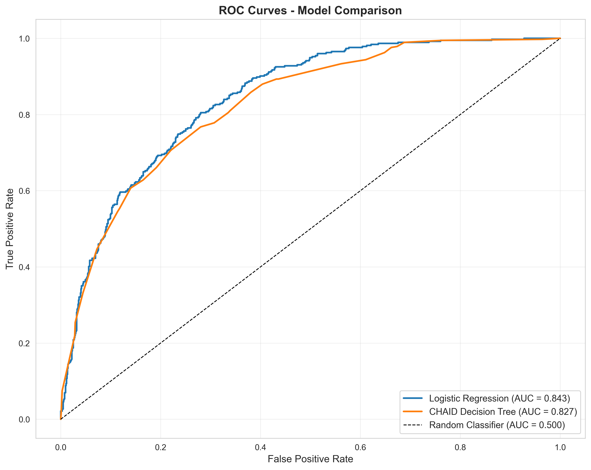
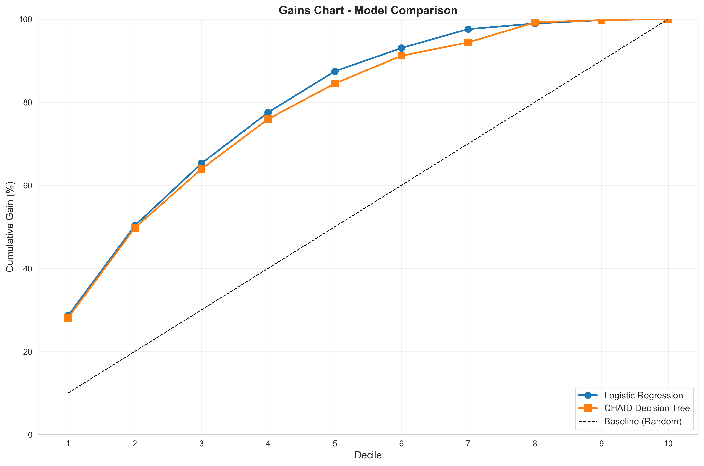
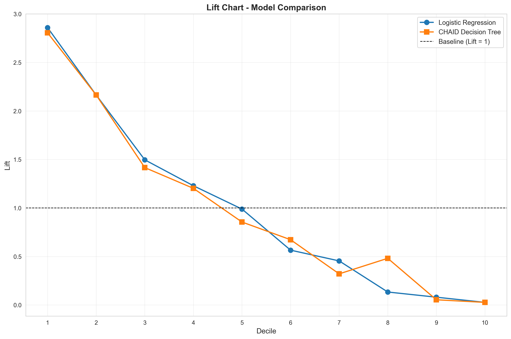

<div align="center">

  <h1>Customer Churn Prediction</h1>
  <p><i>End-to-end, reproducible ML pipeline with training, evaluation, and CLI inference</i></p>

  <p>
    <a href="https://www.python.org/"></a>
    <a href="https://scikit-learn.org/"></a>
    <a href="notebooks/"></a>
    <a href="LICENSE"></a>
    <a href="#-contributors"></a>
  </p>

</div>

<p align="center">
  A production-style, fully reproducible machine learning pipeline for predicting customer churn using Logistic Regression and an interpretable CHAID-style Decision Tree. Includes EDA, feature engineering, training, evaluation (ROC, Gains, Lift), model persistence, CLI prediction, and model update workflow.
</p>


## ✨ Features
- **End-to-end pipeline**: preprocessing, training, evaluation, reporting, artifact saving
- **Two model families**: Logistic Regression and interpretable CHAID-style Decision Tree
- **Business-friendly insights**: rules extracted from the tree with probabilities and support
- **Robust evaluation**: ROC‑AUC, Gains, Lift, and comparative charts auto-saved
- **Reproducible**: deterministic splits and persisted encoders alongside models
- **Simple CLI**: batch predict on CSVs and update/retrain on new data


<details>
  <summary><b>🧭 Table of Contents</b></summary>

- [Quick Start](#-quick-start)
- [Project Overview](#-project-overview)
- [Visuals](#-visuals)
- [Project Structure](#-project-structure)
- [Dataset](#-dataset)
- [Usage](#-usage)
  - [Run the full pipeline](#run-the-full-pipeline)
  - [Predict for new customers](#predict-for-new-customers)
  - [Retrain or update the model](#retrain-or-update-the-model)
- [Modules](#-modules)
- [Notebooks](#-notebooks)
- [Modeling](#-modeling)
- [Evaluation & Outputs](#-evaluation--outputs)
- [API Reference](#-api-reference)
- [Dependencies](#-dependencies)
- [Contributors](#-contributors)
- [License & Acknowledgments](#-license--acknowledgments)

</details>


## ⚡ Quick Start
- **Run the full pipeline**: `python main.py`
- **Predict for new customers**: `python src/predict_churn.py --data data/new_customers.csv --output predictions.csv`
- **Retrain/update model**: `python src/update_model.py --data data/WA_Fn-UseC_-Telco-Customer-Churn.csv`
- **Open notebooks**: `notebooks/churn_analysis.ipynb`, `notebooks/customer_churn_end_to_end.ipynb`


## 📋 Project Overview
This repository implements an end‑to‑end churn prediction workflow:
- **Data Preparation & EDA**: Cleaning, encoding, descriptive stats, and visual analysis
- **Modeling**: Logistic Regression and a CHAID-style Decision Tree (sklearn `DecisionTreeClassifier` tuned for interpretability)
- **Evaluation**: Accuracy, Precision, Recall, F1, ROC‑AUC, Gains and Lift analysis; visual comparisons
- **Operationalization**: Persisted models, CLI prediction for new customers, and model update script


## 🖼️ Visuals

| ROC Curves | Gains Chart | Lift Chart |
| --- | --- | --- |
|  |  |  |

Additional figures are saved under `reports/visuals/`, including categorical/numeric distributions, bivariate analysis, correlation heatmap, and CHAID tree visualization.


## 📁 Project Structure
```text
Customer_Churn_Model/
│
├─ data/
│  └─ WA_Fn-UseC_-Telco-Customer-Churn.csv        # Dataset (IBM Telco churn)
│
├─ notebooks/
│  ├─ churn_analysis.ipynb                         # EDA & CHAID visualization
│  └─ customer_churn_end_to_end.ipynb              # End-to-end walkthrough
│
├─ models/                                         # Generated by pipeline (after training)
│  ├─ churn_model.joblib                           # Best model (with encoders + metadata)
│  ├─ lr_model.joblib                              # Logistic Regression model bundle
│  └─ chaid_model.joblib                           # CHAID Decision Tree model bundle
│
├─ reports/
│  └─ visuals/                                     # Auto-saved charts from evaluation/EDA
│     ├─ roc_curves.png
│     ├─ gains_chart.png
│     ├─ lift_chart.png
│     ├─ categorical_distributions.png
│     ├─ numeric_distributions.png
│     ├─ bivariate_analysis.png
│     ├─ correlation_heatmap.png
│     └─ chaid_tree_visualization.png
│
├─ src/
│  ├─ preprocess.py                                # Load, clean, encode, summary
│  ├─ train.py                                     # Train LR + Decision Tree; extract rules
│  ├─ evaluate.py                                  # Metrics, ROC, Gains, Lift; save charts
│  ├─ predict_churn.py                             # CLI + programmatic churn predictions
│  └─ update_model.py                              # Retrain/update model with new data
│
├─ main.py                                         # Orchestrates the full pipeline
├─ requirements.txt                                # Dependencies
└─ README.md
```


## 📊 Dataset
- Source: IBM Telco Customer Churn dataset (`data/WA_Fn-UseC_-Telco-Customer-Churn.csv`). Online source: [IBM Telco Customer Churn CSV](https://github.com/IBM/telco-customer-churn-on-icp4d/blob/master/data/Telco-Customer-Churn.csv)
- Preprocessing highlights (`src/preprocess.py`):
  - Coerces `TotalCharges` to numeric and fills missing as 0 (new customers)
  - Drops `customerID`
  - One‑hot encodes categorical variables (drop='first') and passes numeric features through
  - Returns encoded `X`, `y`, `feature_names`, and reusable `preprocessor` + target encoder (saved with models)


## 🚀 How to Run
1) Create and activate a virtual environment (recommended), then install dependencies:

```bash
pip install -r requirements.txt
```

Windows (PowerShell) virtual environment example:

```bash
python -m venv .venv
.\.venv\Scripts\Activate.ps1
pip install -r requirements.txt
```

macOS/Linux virtual environment example:

```bash
python -m venv .venv
source .venv/bin/activate
pip install -r requirements.txt
```

2) Execute the full pipeline:

```bash
python main.py
```

This will:
- Load and preprocess data
- Train Logistic Regression + CHAID-style Decision Tree
- Evaluate and compare models
- Persist the best model to `models/churn_model.joblib`
- Save figures to `reports/visuals/`


## 🧩 Modules
- `src/preprocess.py`
  - `prepare_data(file_path)`: load → clean → encode → summarize
  - Encoders (sklearn `ColumnTransformer`, target `LabelEncoder`) are returned and saved with the model

- `src/train.py`
  - `train_models(X, y, feature_names)`: split, train LR + Tree, extract decision rules and top business rules
  - `save_model(obj, path)`: persist model or bundle to disk (joblib)

- `src/evaluate.py`
  - Metrics: Accuracy, Precision, Recall, F1, ROC‑AUC
  - Decile‑based Gains & Lift tables, ROC/Gains/Lift plots saved under `reports/visuals/`

- `src/predict_churn.py`
  - `predict_churn(customer_data, model_path=..., return_proba=True)`: programmatic API
  - CLI for batch CSV prediction

- `src/update_model.py`
  - `update_model(new_data_path, model_path=...)`: retrain with new data, evaluate, and overwrite or save updated model(s)


## 📓 Notebooks
- `notebooks/churn_analysis.ipynb`: EDA (univariate, bivariate), correlation heatmap, CHAID visualization & rules
- `notebooks/customer_churn_end_to_end.ipynb`: Walkthrough of the end‑to‑end pipeline on the Telco dataset

Open directly in Jupyter:

```bash
jupyter notebook notebooks/churn_analysis.ipynb
jupyter notebook notebooks/customer_churn_end_to_end.ipynb
```


## 🤖 Modeling
- **Logistic Regression**: `solver='lbfgs'`, `max_iter=1000`; strong baseline, interpretable coefficients
- **CHAID-style Decision Tree**: `DecisionTreeClassifier(max_depth=5, min_samples_leaf=20, min_samples_split=50)` for compact, interpretable rules
- Business rules automatically extracted from tree paths with churn probability and sample counts


## 📈 Evaluation & Outputs
The pipeline generates the following artifacts automatically:

- Metrics per model: Accuracy, Precision, Recall, F1, ROC‑AUC
- Decile analysis: Gains and Lift tables and charts
- Visual comparisons saved in `reports/visuals/`:
  - ROC Curves: `reports/visuals/roc_curves.png`
  - Gains Chart: `reports/visuals/gains_chart.png`
  - Lift Chart: `reports/visuals/lift_chart.png`
  - EDA Figures: `categorical_distributions.png`, `numeric_distributions.png`, `bivariate_analysis.png`, `correlation_heatmap.png`
  - CHAID Tree: `chaid_tree_visualization.png`

Key insights commonly observed on Telco churn:
- **Contract Type**: Month‑to‑month has the highest churn
- **Tenure**: Lower tenure (0–12 months) customers churn more
- **Payment Method**: Electronic check customers show elevated churn
- **Charges**: Higher `MonthlyCharges` correlates with higher churn risk


## 🔁 Reproducibility
- Deterministic splits and models via `random_state=42` (see `train.py`).
- One‑hot encoding is fit once during training and reused at inference (saved inside the model bundle).
- For consistent results, keep the same dataset version and preprocessing pipeline.


## 🧳 Model Artifacts
Saved `.joblib` files in `models/` are bundles (Python dicts) with:

```python
{
  'model': sklearn_estimator,
  'encoders': {
      'preprocessor': ColumnTransformer(...),
      'target': LabelEncoder(...)
  },
  'feature_names': List[str],
  'model_name': 'Logistic Regression' | 'CHAID Decision Tree',
  'metadata': {
      'training_samples': int,
      'test_samples': int,
      'features': int
  },
  # present for CHAID bundles only:
  'tree_rules': str,
  'business_rules': List[dict]
}
```

Usage example:

```python
import joblib
bundle = joblib.load('models/churn_model.joblib')
model = bundle['model']
X = bundle['encoders']['preprocessor'].transform(df)
proba = model.predict_proba(X)[:, 1]
```


## 🖥️ Usage
### Run the full pipeline

```bash
python main.py
```

### Predict for new customers
- Predict churn for a CSV of customers:

```bash
python src/predict_churn.py --data data/new_customers.csv --model models/churn_model.joblib --output predictions.csv
```

Programmatic example:

```python
from src.predict_churn import predict_churn

customer = {
    'gender': 'Male',
    'SeniorCitizen': 0,
    'Partner': 'Yes',
    'Dependents': 'No',
    'tenure': 12,
    'PhoneService': 'Yes',
    'MultipleLines': 'No',
    'InternetService': 'Fiber optic',
    'OnlineSecurity': 'No',
    'OnlineBackup': 'No',
    'DeviceProtection': 'No',
    'TechSupport': 'No',
    'StreamingTV': 'Yes',
    'StreamingMovies': 'Yes',
    'Contract': 'Month-to-month',
    'PaperlessBilling': 'Yes',
    'PaymentMethod': 'Electronic check',
    'MonthlyCharges': 99.65,
    'TotalCharges': 1189.8
}

results = predict_churn(customer, model_path="models/churn_model.joblib")
print(results)
```

### Retrain or update the model

```bash
python src/update_model.py --data data/WA_Fn-UseC_-Telco-Customer-Churn.csv --model models/churn_model.joblib
```


## 🧪 API Reference
- `preprocess.prepare_data(file_path) -> (X, y, feature_names, encoders, df)`
- `train.train_models(X, y, feature_names) -> dict` (includes models, splits, rules)
- `evaluate.evaluate_models(lr_model, chaid_model, X_test, y_test, feature_names) -> (comparison_df, gains_lift_lr, gains_lift_tree)`
- `predict_churn.predict_churn(customer_data, model_path, return_proba=True) -> pd.DataFrame`


## ❓ Troubleshooting
- "Model file not found": Run `python main.py` to train and create `models/*.joblib` first.
- Shape/feature mismatch on prediction: Ensure inference data uses the same columns and dtypes used in training; the saved `preprocessor` handles encoding.
- Charts not appearing: Images are saved under `reports/visuals/`; ensure the directory exists and you have write permissions.
- Jupyter plots don't render: Add `%matplotlib inline` or run cells that produce plots.


## 📦 Dependencies
See `requirements.txt`. Install with:

```bash
pip install -r requirements.txt
```

- Python 3.7+
- pandas, numpy, scikit‑learn, matplotlib, seaborn, joblib, jupyter


## 🤝 Contributing
Contributions of any kind are welcome! If you’d like to contribute:
- Fork the repository and create a new branch
- Make your changes with clear commit messages
- Open a pull request describing the change and rationale


## 👥 Contributors

[](#-contributors)

<table>
  <tr>
    <td align="center" valign="top" width="140">
      <a href="https://github.com/Pragadees15">
        <br />
        <sub><b>Pragadeeswaran K</b></sub>
      </a>
      <br />💻 📖 📊
    </td>
    <td align="center" valign="top" width="140">
      <a href="https://github.com/SHYAM140305">
        <br />
        <sub><b>Shyam J</b></sub>
      </a>
      <br />💻 🔬 🧪
    </td>
    <td align="center" valign="top" width="140">
      <a href="https://github.com/aditiv101">
        <br />
        <sub><b>Aditi V</b></sub>
      </a>
      <br />📊 📈 📖
    </td>
  </tr>
  <tr>
    <td align="center"><sub>code, docs, data</sub></td>
    <td align="center"><sub>code, research, tests</sub></td>
    <td align="center"><sub>data, analysis, docs</sub></td>
  </tr>
</table>

This project follows the [all-contributors](https://allcontributors.org) specification. Contributions of any kind are welcome!


## 📄 License & Acknowledgments
- License: MIT License — see [LICENSE](LICENSE)
- Dataset: [IBM Telco Customer Churn CSV](https://github.com/IBM/telco-customer-churn-on-icp4d/blob/master/data/Telco-Customer-Churn.csv)
- Libraries: scikit‑learn, pandas, matplotlib, seaborn, joblib, jupyter

---

Note: Run `python main.py` first to train and save models under `models/` before invoking prediction scripts.

